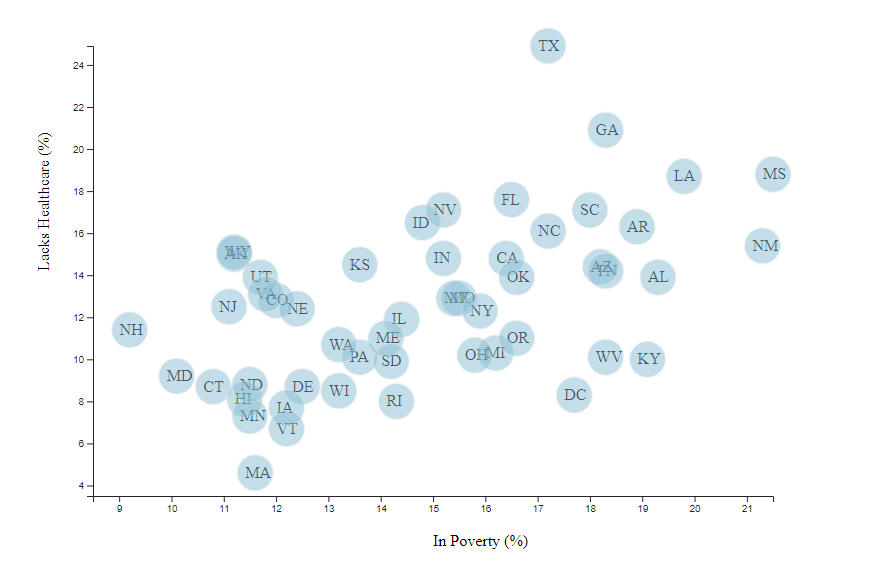
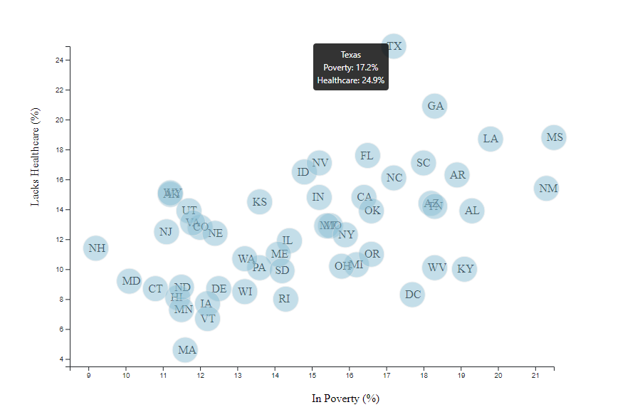
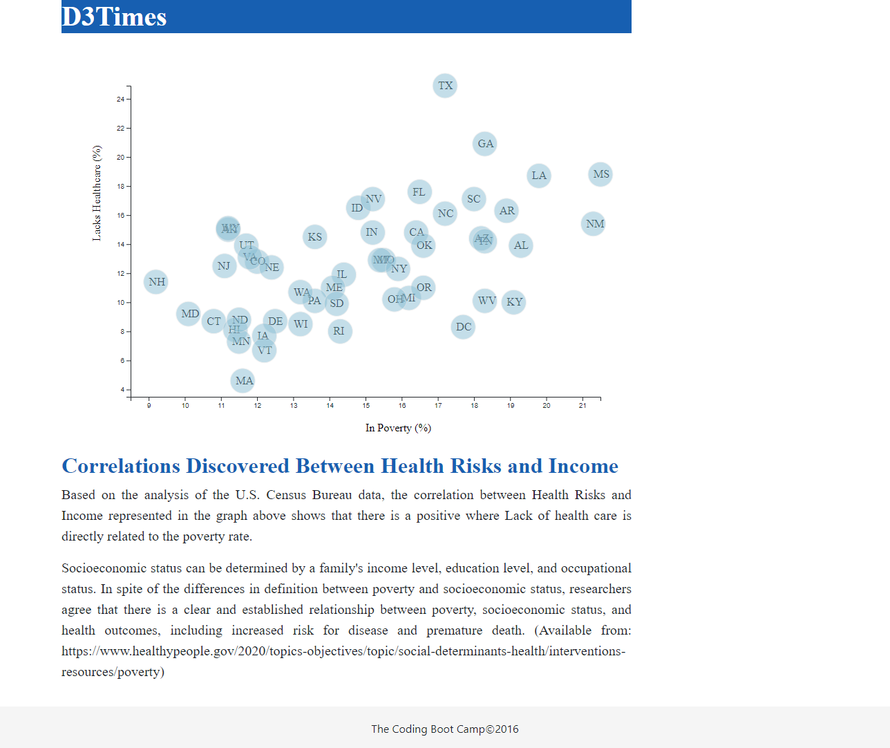

# D3-challenge
# Data Journalism and D3

## Background

Welcome to the newsroom! The editor wants to run a series of feature stories about the health risks facing particular demographics. The first story is base on information from the U.S. Census Bureau and the Behavioral Risk Factor Surveillance System to investigate the relationship between poverty with demographic factors and health risks for 50 states.

The data set included with the assignment is based on 2014 ACS 1-year estimates from the [US Census Bureau](https://data.census.gov/cedsci/)

## D3 Dabbler

Using the D3 techniques, a scatter plot that represents each state with circle elements was created showing the relationship between poverty rate (x-axis) and lack of health care (y-axis).

#### 2. Incorporate d3-tip

While the ticks on the axes allow to infer approximate values for each circle, it's impossible to determine the true value without adding another layer of data. Tooltips were added to the circles in order to display each tooltip with relevant data to each State.

## Deployment

This app is deployed public on GitHub page, click the following link to see how it looks like [D3 Time Home page](https://jessicapardo.github.io/D3-challenge/)

To view the [JavaScript Code](assets/js/app.js)
To view the [HTML code](index.html)
To view [Data](assets/data/data.csv)

### Copyright

Trilogy Education Services © 2019. All Rights Reserved.

